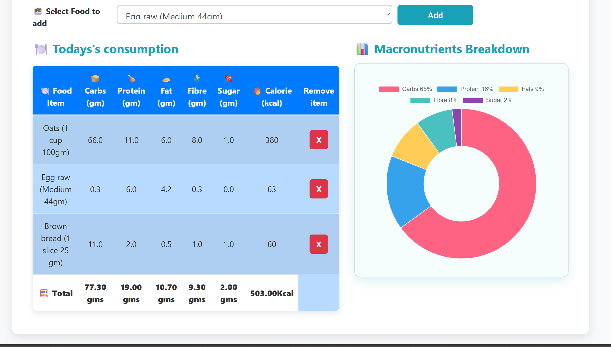

# 🥗 Calorie Tracker Web App

A simple and elegant web app built with Django to help users track their daily food intake by monitoring calories, carbs, proteins, and fats — now with visual charts!

---

## 🚀 Features

- ✅ Add and select food items
- ✅ Automatically calculates total calories and macronutrients
- ✅ Displays a beautiful **chart of nutrient breakdown**
- ✅ Clean UI using Bootstrap 4
- ✅ Responsive and interactive interface
- ✅ Progress bar for visual feedback

---

## 📊 Charts

- Uses **Chart.js**  to show nutrient distribution
- Visual representation of **Carbs, Proteins, and Fats**
- Helps users quickly assess their daily intake

---

## 📸 Screenshots
<p align="center>
  
</p>




---

## 🛠️ Tech Stack

- **Backend:** Django 4.x, Python 3.x
- **Frontend:** Bootstrap 4, HTML5, CSS3, JavaScript
- **Charting Library:** Chart.js (or specify your library)
- **Database:** SQLite (default Django)

---

## ⚙️ Installation

```bash
# 1. Clone the repo
git clone https://github.com/your-username/calorie-tracker.git
cd calorie-tracker

# 2. Create virtual environment
python -m venv venv
source venv/bin/activate     # Windows: venv\Scripts\activate

# 3. Install dependencies
pip install -r requirements.txt

# 4. Run the development server
python manage.py runserver

# 5. Run this in your browser
http://127.0.0.1:8000/ 
